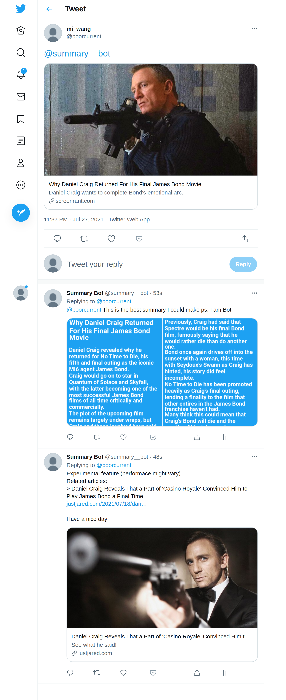

# Summary Twitter Bot
Twitter bot which replies with summary of mentioned article inform of images and provides related articles

# Example Output
####[tweet link](https://twitter.com/poorcurrent/status/1420083498950414339)

     

##  How to use the bot:
Mention the bot ([@summary__bot](https://twitter.com/summary__bot)) in the tweet and add the article link whose summary is needed. Mention only one URL link in the tweet or else the summary will not be generated. In 30 seconds, two replies (summary + related article) will be created by the bot

## Flowchart of Twitter Reply 

     

